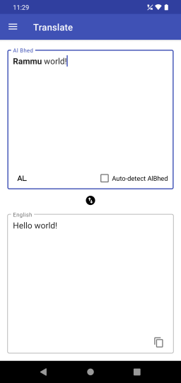
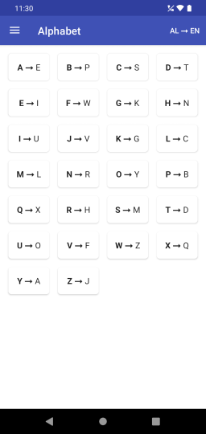
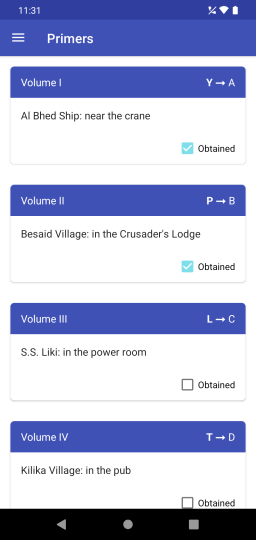

# Al Bhed Translator

Android application to translate text written in the fictional [Al Bhed language](https://finalfantasy.fandom.com/wiki/Al_Bhed#Language) from the videogame [Final Fantasy X](https://wikipedia.org/wiki/Final_Fantasy_X).

## Al Bhed language

The Al Bhed language is a fictional language spoken by the Al Bhed tribe in the fantasy world of Spira from the videogame Final Fantasy X. In the english versions of the game, the Al Bhed language is written like english but with a substitution cypher applied to it. 

As you progress through the game, you'll start to learn more of the Al Bhed language, but a translator can still be a very useful tool for the many early spoken lines and written messages for which you have no chance of understanding unless you've played the game multiple times.

## Features

 * Translate to and from Al Bhed
 * Detect which characters are Al Bhed automatically based on the obtained primers. Just write the subtitles as they appear and the app does the rest
 * Easy to use alphabet reference for the occasional single character translation
 * Handy reference of all the primers and their locations

## Download

Download the [latest release](https://github.com/trigonated/AlBhedTranslator/releases/download/v1.0/AlBhedTranslator_1_0.apk) from the releases page.

Note: You might need to enable [installation of apps from unknown sources](https://www.wikihow.com/Allow-Apps-from-Unknown-Sources-on-Android) before you can install this application.

## Building from source

This is a standard gradle project created using Android Studio. Check the [developer guides](https://developer.android.com/guide/) for additional information on how to build projects like this one.

## Stack

 * AppCompat
 * Material Design Components
 * Kotlin Flows and Coroutines
 * Lifecycle (ViewModel)
 * Navigation
 * Hilt (Dagger)
